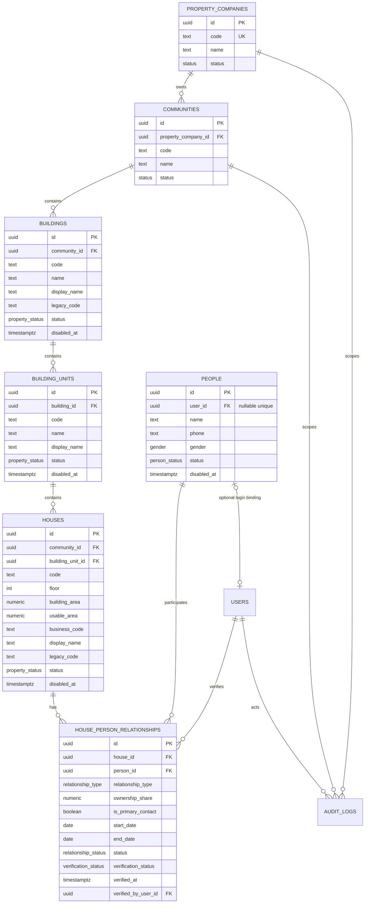

# Phase 2 Architecture Review
# 房屋 + 客户 / 业主 / 住户真实数据底座

## 0. 审查边界与最终推荐

本报告基于 `main` 提交 `2a9d7419028bb68d646fe3328821cd9cda4e5aca`，分支为 `codex/phase2-property-resident-architecture`。本轮只做代码审查和数据架构设计：没有创建 migration、数据库表、API、前端页面，也没有迁移报修或其它业务。

最终推荐只有一套：

1. 复用 Phase 1 的 `property_companies`、`communities`、`users`、RBAC、`Scope` 和 `audit_logs`。
2. 新增的领域主实体为 `buildings`、`building_units`、`houses`、`people`、`house_person_relationships`。
3. 不创建 `customers`、`residents`、`owners`、`tenants` 等重复人员表；所有现实自然人统一进入 `people`。
4. `users` 继续只表示登录账户；`people.user_id` 可空且唯一，用于可选绑定。
5. 房屋层级始终拆成 Community -> Building -> BuildingUnit -> House，`16-2-502` 只能作为展示/兼容编码，不能作为唯一结构字段。
6. 人与房屋通过带历史的多对多关系表达；多个 `OWNER` 关系即可表达共同业主，不增加 `CO_OWNER` 类型。
7. 房屋是否有人居住由有效关系推导，不把 `OCCUPIED` / `VACANT` 作为容易失真的人工状态；房屋只保留运营生命周期状态。

## 1. 当前 Demo 数据盘点

### 1.1 组织和小区

`src/data/seed.js` 的 `organization` 是内存对象：

- companies：`property-a`、`property-b`、`partner`。
- communities：`pengyi`、`penger`、`jinxiu`、`lvzhou`，每条只有 `id`、`name`、`companyId`。
- 没有楼栋、单元、房屋实体，也没有数据库外键。

`src/services/store.js` 会将 `state.user.communityId` 和 `state.contexts.property/worker.communityId` 作为当前上下文；这些是浏览器本地状态，不是后端 `Scope`。

### 1.2 居民、业主和个人资料

`initialState().user` 当前是单个演示用户：

```js
{
  id: 'resident-1',
  name: '李女士',
  phone: '13800006688',
  room: '16-2-502',
  area: 98,
  community: '彭一小区',
  communityId: 'pengyi',
  verified: true,
  role: 'owner'
}
```

这一个对象同时承担登录后的居民、业主、联系人、房屋选择和认证结果，不能直接成为正式模型。没有 `Person`、House、关系记录，也没有历史或多人关系。

### 1.3 楼栋、单元、房号和面积

- 楼栋、单元、房号只存在于字符串 `room`，例如 `16-2-502`。
- `src/pages/resident.js` 的认证表单只用正则校验 `楼栋-单元-房号` 格式。
- `src/app.js` 的“切换房屋”只是切换同一个字符串选项，并且演示了地下车位与住宅的文字关联。
- `area` 是 `98` 这样的单个数字，没有面积单位、面积类型、来源或变更历史。
- 没有展示地址、业务编码、楼栋/单元/房屋状态。

### 1.4 房屋认证和人员身份

`src/pages/resident.js` 的认证流程：

- 业主/租客是页面局部变量 `role`，不是持久化关系类型。
- 身份证输入是演示校验，页面明确提示不会调用真实公安或房产接口。
- 提交后只写 `state.user.name`、`state.user.role`、`state.user.verified`，并追加一条本地 `logs` 记录。
- 租客上传租约仍是演示附件，不建立租户与房屋的时间关系。

### 1.5 报修、工单和账单中的房屋数据

`src/data/seed.js` 的订单、`src/services/store.js` 的 `createOrder`、`src/pages/operations.js` 和 `src/pages/resident.js` 均使用 `order.room` 字符串。联系人和电话直接复制到订单：

- `room`：文字房号或公共区域文字。
- `contact` / `phone`：当前演示用户或输入框值。
- `communityId` / `companyId`：由当前浏览器上下文推导。

账单也只保存 `room`；维修结算账单通过 `orderId` 关联 Demo 工单。没有正式 `house_id`、`person_id` 或关系快照。

### 1.6 个人中心、居民管理和搜索

- 居民端个人中心显示 `state.user.community`、`state.user.room`、姓名和电话。
- 物业端“房产与居民管理”实际只对 `list([state.user])` 操作一条演示数据，可编辑姓名、手机号、房号，可把 `verified` 改为 `true`。
- 物业端搜索只在本地 `orders` 上匹配 `id`、`room`、`title`、`contact`。
- 没有居民目录、房屋目录、后端搜索或数据库范围查询。

### 1.7 Demo 模型不能直接用于正式后端的地方

1. `state.user` 将登录账户、自然人、业主、联系人和当前房屋混成一条记录。
2. `room` 是不可约束、不可可靠连接的字符串，无法支持楼栋/单元/房屋外键。
3. `community` 名称和 `communityId` 可由前端切换，不能作为授权依据。
4. `verified` 是无主体、无审核人、无时间和无证据类型的布尔值。
5. `role: 'owner'` 没有租户、家庭成员、居住人、多人多房和历史关系能力。
6. `area` 没有 `numeric` 精度、面积类型和单位约束。
7. 订单/账单只复制当前电话和房号；联系人变更后无法保留历史现场信息。
8. Demo 的 `localStorage` 可以被浏览器用户直接修改，不能替代后端租户和小区 Scope。
9. Demo `id()` 使用时间戳加随机字符串，不是正式数据库 UUID。

## 2. 领域模型

### 2.1 ER Diagram



### 2.2 组织边界

`property_companies` 和 `communities` 不复制。所有新实体通过 `community_id` 向上连接到既有物业公司：

`house -> building_unit -> building -> community -> property_company`。

查询、写入和授权都必须沿这条链解析真实 Scope。请求中的 `communityId`、`buildingId` 或 `propertyCompanyId` 只作筛选候选，不能改变登录身份的范围。

## 3. Building / Unit / House 模型

### 3.1 Building

正式英文名称：`Building`，表名 `buildings`。

字段：

| 字段 | 类型 | 规则 |
|---|---|---|
| `id` | UUID | 主键，数据库生成 |
| `community_id` | UUID | FK -> `communities.id`，必填 |
| `code` | text | 小区内稳定业务编号，例如 `16` |
| `name` | text | 楼栋名称，例如 `16号楼` |
| `display_name` | text | 展示文本，可与 code 不同 |
| `legacy_code` | text nullable | 旧 Demo 或外部导入编码 |
| `status` | `ACTIVE` / `INACTIVE` | 生命周期状态 |
| `disabled_at` | timestamptz nullable | 停用时间 |
| `created_at` / `updated_at` | timestamptz | 审计时间 |

`UNIQUE (community_id, code)`。楼栋不物理删除。

### 3.2 BuildingUnit

正式英文名称：`BuildingUnit`，表名 `building_units`。不使用含义不清的 `units` 作为跨领域主表名。

字段：`id`、`building_id`、`code`、`name`、`display_name`、`status`、`disabled_at`、`created_at`、`updated_at`。`code` 表示单元、门或入口，例如 `2`、`东门`；`UNIQUE (building_id, code)`。

单元沿用楼栋状态边界；停用单元不会删除其历史房屋或业务记录。

### 3.3 House

表名 `houses`，表示可被物业运营的住宅/房屋单元，不扩展为房地产交易或产权登记系统。

字段：

| 字段 | 类型 | 规则 |
|---|---|---|
| `id` | UUID | 主键 |
| `community_id` | UUID | 冗余保存所属小区，FK -> `communities.id`；由服务端从单元层级校验一致性 |
| `building_unit_id` | UUID | FK -> `building_units.id` |
| `code` | text | 单元内房号，例如 `502` |
| `floor` | integer nullable | 楼层；地下层可使用负数约定 |
| `building_area` | numeric(10,2) | 建筑面积，单位平方米，必填或导入时明确为 nullable |
| `usable_area` | numeric(10,2) nullable | 使用面积，未知时为空，不猜测 |
| `business_code` | text | 由层级组成的稳定业务编码，例如 `16-2-502` |
| `display_name` | text | 例如 `16号楼2单元502室` |
| `legacy_code` | text nullable | 旧 Demo `room` 或外部系统编码 |
| `status` | `ACTIVE` / `RENOVATING` / `INACTIVE` | 房屋运营生命周期 |
| `disabled_at` | timestamptz nullable | 停用时间 |
| `created_at` / `updated_at` | timestamptz | 时间字段 |

推荐 `UNIQUE (building_unit_id, code)` 和 `UNIQUE (community_id, business_code)`。写入房屋时，服务端必须在同一事务中确认 `community_id` 与 `building_unit_id -> building -> community` 一致；数据库外键保证两个 UUID 都存在，Repository 不接受客户端用不一致的两组 ID 绕过层级。`OCCUPIED` / `VACANT` 不存为独立事实：通过有效的 `HOUSE_PERSON_RELATIONSHIPS` 推导，避免状态和关系不一致。

## 4. Person、User 与关系

### 4.1 Person

统一自然人主表：`people`。不创建 `customers`、`residents`、`owners`、`tenants`。

字段：

| 字段 | 类型 | 规则 |
|---|---|---|
| `id` | UUID | 主键 |
| `user_id` | UUID nullable | FK -> `users.id`；唯一；没有登录账号时为空 |
| `name` | text | 必填，历史业务快照不随之改写 |
| `phone` | text nullable | 第一版只保存一个主联系电话；可为空 |
| `gender` | enum nullable | `UNKNOWN` / `FEMALE` / `MALE` / `OTHER`，非业务必填 |
| `status` | `ACTIVE` / `DISABLED` | 人员生命周期 |
| `disabled_at` | timestamptz nullable | 禁用时间 |
| `created_at` / `updated_at` | timestamptz | 时间字段 |

不保存完整身份证号。身份证、OCR、实名、公安接口和人脸识别均不在本阶段范围。未来确有实名需求时，另做加密、密钥、访问审计和保留期限设计，不把字段直接加到 `people`。

### 4.2 User 与 Person

- `User` 是系统登录身份，继续使用现有 `users`、session 和 RBAC。
- `Person` 是现实世界自然人，可没有登录账号。
- `people.user_id` 可空且唯一，表示一个 User 最多绑定一个 Person，一个 Person 最多绑定一个 User。
- User 可以同时是物业员工、房屋关系人和其它协同身份；这些身份由现有 `company_memberships`、RBAC 和房屋关系分别表达，不能把员工字段复制到 `people`。
- 服务账号或只用于后台授权的 User 可以不绑定 Person。

手机号不是 User/Person 的身份主键。第一版每个 Person 只保存一个主联系电话；不提前引入多号码子表。未来确有多个号码需求时再以独立联系方式实体扩展，不改变 Person 主键。现有 Phase 1 `users.phone` 的全局唯一约束继续保留用于登录；`people.phone` 不做全局唯一，以允许家庭共用电话和录入重复待核实数据。对 `people.phone` 建规范化检索索引，重复号码由后台提示而不是静默覆盖。

### 4.3 HousePersonRelationship

表名：`house_person_relationships`。

最终关系类型只有：

- `OWNER`
- `TENANT`
- `FAMILY_MEMBER`
- `OCCUPANT`

不增加 `CO_OWNER`。多个 `OWNER` 行即可表达共同业主；可选 `ownership_share numeric(5,2)` 表示份额，范围 0 到 100。`is_primary_contact` 表示物业联络人，不表示唯一业主。

字段：

| 字段 | 类型 | 规则 |
|---|---|---|
| `id` | UUID | 主键 |
| `house_id` | UUID | FK -> `houses.id` |
| `person_id` | UUID | FK -> `people.id` |
| `relationship_type` | enum | 上述四种之一 |
| `ownership_share` | numeric(5,2) nullable | 仅 OWNER 使用；非 OWNER 必须为空 |
| `is_primary_contact` | boolean | 每个房屋可有 0 或 1 个有效主联系人 |
| `start_date` | date | 关系生效日 |
| `end_date` | date nullable | 结束日，不能早于 start_date |
| `status` | `ACTIVE` / `ENDED` | 结束关系时置 `ENDED`，保留行 |
| `verification_status` | `UNVERIFIED` / `PENDING` / `VERIFIED` / `REJECTED` | 关系事实的核验状态 |
| `verified_at` | timestamptz nullable | 核验时间 |
| `verified_by_user_id` | UUID nullable | FK -> `users.id`，核验操作人 |
| `created_at` / `updated_at` | timestamptz | 时间字段 |

第一版不加入 `can_submit_repair`、`billing_responsibility` 两个布尔字段。报修资格由有效、已核验关系类型决定；账单责任待收费领域设计时以明确的账单责任实体表达，避免把财务语义埋在关系表中。

## 5. 外键、唯一约束和索引

### 5.1 Foreign Keys

- `buildings.community_id -> communities.id`。
- `building_units.building_id -> buildings.id`。
- `houses.community_id -> communities.id`，并由事务校验与所属 unit 的 community 一致。
- `houses.building_unit_id -> building_units.id`。
- `people.user_id -> users.id`，`ON DELETE RESTRICT` 或先解绑再停用。
- `house_person_relationships.house_id -> houses.id`。
- `house_person_relationships.person_id -> people.id`。
- `house_person_relationships.verified_by_user_id -> users.id`。

不使用级联物理删除；历史业务需要保留关联。

### 5.2 Unique Constraints

- `property_companies.code`、`communities(property_company_id, code)`：沿用 Phase 1 约束。
- `buildings(community_id, code)`。
- `building_units(building_id, code)`。
- `houses(building_unit_id, code)`。
- `houses(community_id, business_code)`，其中 `community_id` 是由层级派生并由服务端校验一致性的冗余 FK。
- `people.user_id` 的唯一部分索引，允许 NULL。
- `house_person_relationships(house_id, person_id, relationship_type)` 的有效关系部分唯一索引，防止重复 active 关系；历史 `ENDED` 记录可重复。

同一房屋的有效 `is_primary_contact=true` 使用 PostgreSQL 部分唯一索引保证最多一个。OWNER 份额总和是否必须为 100% 不作为数据库跨行 CHECK，创建/修改关系时在事务中校验并记录异常。

### 5.3 Indexes

- 每个 FK：`buildings.community_id`、`building_units.building_id`、`houses.building_unit_id`。
- `houses.business_code`、`houses.legacy_code`、`houses.code`。
- `people.phone` 规范化值和 `people.name` 的检索索引；第一版使用前缀/精确检索，不盲目引入全文搜索。
- `house_person_relationships.house_id`、`person_id`、`relationship_type`、`status`、`verification_status`、`end_date` 的组合检索索引。
- 既有 `audit_logs(property_company_id, community_id)` 等索引继续复用。

## 6. 生命周期、删除和历史

| 实体 | 推荐方式 | 说明 |
|---|---|---|
| Building | `status` + `disabled_at` | 停用而非删除；保留历史地址和工单关联 |
| BuildingUnit | `status` + `disabled_at` | 停用后不能创建新房屋，但可读历史 |
| House | `status` + `disabled_at` | `INACTIVE` 表示不再运营；不删除历史关系 |
| Person | `status` + `disabled_at` | 人员停用，历史账单/报修仍可显示快照 |
| HouseRelationship | `status` + `end_date` | 结束关系，不物理删除；核验记录和审计保留 |

房屋结构变更时创建新实体或明确变更事件，不复用旧 UUID 指向另一套房。所有后续业务都保存正式 UUID，并在发生时写入姓名、电话、展示地址等不可变历史快照。

## 7. 权限与 Scope

### 7.1 推荐权限

保持 Phase 1 的权限编码风格，只增加八个最小资源动作：

- `building:read`、`building:write`：楼栋和单元。
- `house:read`、`house:write`：房屋资料。
- `person:read`、`person:write`：自然人目录及手机号修改。
- `house_relation:read`、`house_relation:write`：建立、修改、核验、结束关系。

不新建 tenant/company/login/permission 体系，也不为每个字段创建权限。`write` 仍由后端按动作和角色细分，不能把前端按钮当成授权。

### 7.2 角色建议

| 角色 | 推荐范围和能力 |
|---|---|
| `PLATFORM_ADMIN` | 平台 bypass，按现有规则可访问全部租户；所有操作写审计 |
| `PROPERTY_ADMIN` | 自己物业公司的全部小区、楼栋、单元、房屋、Person 和关系读写 |
| `COMMUNITY_MANAGER` | 仅授权小区；可管理该范围内楼栋、单元、房屋、Person 和关系 |
| `PROPERTY_STAFF` | 仅授权小区读权限；确有岗位需要时再授予明确的 write，不默认写 |
| `ENGINEER` | 不授予 `person:read` 或居民目录权限；Phase 3 只通过当前工单的最小联系人投影获取信息 |

所有角色仍通过既有 `user_role_assignments`、`Scope.companyIds`、`Scope.communityIds` 和后端 Repository 过滤。项目经理不能通过请求体传入另一个 `communityId` 扩大范围。

### 7.3 手机号隐私

后端序列化层根据调用者 Scope 和角色返回字段：

- 默认目录响应：`maskedPhone`，例如 `138****1234`；不返回完整 `phone`。
- `PROPERTY_ADMIN` 在自己公司范围内可获得完整电话，必须是明确的人员管理读取路径并写审计。
- `COMMUNITY_MANAGER`、`PROPERTY_STAFF` 默认只返回脱敏电话；只有未来明确的、受审计的业务动作才能得到必要完整号码。
- `ENGINEER` 不得搜索 Person；未来工单详情只返回当前工单必要的联系人姓名、必要电话和房屋位置。

脱敏必须在 Repository/DTO 层完成，不能只靠前端隐藏。日志、错误、搜索结果和导出同样执行脱敏规则。

## 8. 搜索、分页和 API Scope

### 8.1 列表参数

第一版所有列表统一支持：

`page`（默认 1）、`pageSize`（默认 20，最大 100）、`communityId`、`buildingId`、`unitId`、`houseId`、`keyword`、`relationshipType`、`status`、`sort`。

返回 `{ items, page, pageSize, total }`。大规模数据后续再增加 cursor，不在第一批引入两套分页协议。

### 8.2 服务端限制

Repository 先从 session 得到 `Scope`，再构造层级 JOIN：

```sql
houses
JOIN building_units ON ...
JOIN buildings ON ...
JOIN communities ON ...
WHERE communities.property_company_id = ANY(:scope_company_ids)
  AND communities.id = ANY(:scope_community_ids)
```

公司管理员使用公司范围；小区经理和员工使用授权小区范围。请求中的 `communityId` 只能与 Scope 求交集；如果不在范围内，列表返回空或详情返回 404，不返回“存在但无权”的信息。`GET /people` 的姓名/电话搜索同样必须先套 Scope，再执行 keyword 条件。

### 8.3 第一批 API

以下为设计清单，不是本轮实现：

#### Buildings / Units

- `GET /api/v1/buildings`
- `POST /api/v1/buildings`，body 含 `communityId`、`code`、`name`、`displayName`
- `GET /api/v1/buildings/:id`
- `PATCH /api/v1/buildings/:id`
- `POST /api/v1/buildings/:id/disable`
- `GET /api/v1/buildings/:buildingId/units`
- `POST /api/v1/buildings/:buildingId/units`
- `GET /api/v1/units/:id`
- `PATCH /api/v1/units/:id`
- `POST /api/v1/units/:id/disable`

#### Houses

- `GET /api/v1/houses`
- `POST /api/v1/houses`，body 含 `buildingUnitId`、`code`、`floor`、面积和展示字段
- `GET /api/v1/houses/:id`
- `PATCH /api/v1/houses/:id`
- `POST /api/v1/houses/:id/disable`
- `GET /api/v1/houses/:id/relationships`

#### People

- `GET /api/v1/people`
- `POST /api/v1/people`
- `GET /api/v1/people/:id`
- `PATCH /api/v1/people/:id`
- `POST /api/v1/people/:id/disable`

#### House relationships

- `POST /api/v1/houses/:id/relationships`
- `GET /api/v1/people/:id/relationships`
- `PATCH /api/v1/house-relationships/:id`
- `POST /api/v1/house-relationships/:id/end`
- `POST /api/v1/house-relationships/:id/verify`

所有写接口都执行 Scope 校验、输入校验和 Audit Log；不接受客户端提交的 `propertyCompanyId` 作为授权依据。房屋路径参数查不到或越权时统一使用 404，避免泄露跨租户资源存在性。

## 9. Audit Log

复用 `audit_logs`，在现有 `property_company_id`、`community_id`、`actor_user_id`、`resource_type`、`resource_id`、`before_data`、`after_data` 结构上记录：

- `BUILDING_CREATED`、`BUILDING_UPDATED`、`BUILDING_DISABLED`。
- `BUILDING_UNIT_CREATED`、`BUILDING_UNIT_UPDATED`、`BUILDING_UNIT_DISABLED`。
- `HOUSE_CREATED`、`HOUSE_UPDATED`、`HOUSE_DISABLED`。
- `PERSON_CREATED`、`PERSON_UPDATED`、`PERSON_PHONE_VIEWED`、`PERSON_DISABLED`。
- `HOUSE_RELATION_CREATED`、`HOUSE_RELATION_UPDATED`、`HOUSE_RELATION_ENDED`。
- `HOUSE_RELATION_VERIFICATION_SUBMITTED`、`HOUSE_RELATION_VERIFIED`、`HOUSE_RELATION_REJECTED`。

Audit payload 不写完整密码、session token、身份证、完整手机号或其它不必要敏感信息。手机号查看应记录资源和操作者，但不把完整号码复制进日志。

## 10. Demo 到正式模型的渐进映射

不删除 Demo Store；迁移采用旁路读取、逐模块替换。

| Demo 字段/结构 | 正式映射 | 迁移说明 |
|---|---|---|
| `state.organization.companies[]` | `property_companies` | `legacy_code` 或导入映射保存 `property-a` 等旧 ID |
| `state.organization.communities[]` | `communities` | 旧 `id` 进入导入映射，正式使用 UUID |
| `state.contexts.*.communityId` | session Scope 的 `communityIds` | 不能由前端状态作为授权来源 |
| `state.user.id` | `users.id` 或 Demo-only 标识 | 不直接当 Person 主键 |
| `state.user.name` | `people.name` | 创建/匹配 Person 后写入 |
| `state.user.phone` | `people.phone`，登录时另存 `users.phone` | 不默认假设两个号码永远相同 |
| `state.user.community` | 由 `house -> ... -> community` 关联展示 | 不保存为 Person 的自由文本事实 |
| `state.user.communityId` | `communities.id` | 只作为旧数据导入映射 |
| `state.user.room` | `houses.id`；解析为 Building `16`、Unit `2`、House `502` | 原字符串写入 `houses.legacy_code` |
| `state.user.area` | `houses.building_area` | 单位平方米；无法确认时不要填零 |
| `state.user.verified` | `house_person_relationships.verification_status` | 认证属于人与房屋关系，不是 Person 全局属性 |
| `state.user.role === 'owner'/'tenant'` | `relationship_type=OWNER/TENANT` | 关系需有起止日期和核验状态 |
| `orders[].room` | 未来 `repairs.house_id` + `location_snapshot` | 公共区域报修可没有 house_id，但保留位置快照 |
| `orders[].contact/phone` | `requester_person_id` + `contact_snapshot` | 创建时保存姓名/电话快照 |
| `bills[].room` | 未来账单的 `house_id` | 不再以房号文字作连接键 |
| “切换房屋” | 选择当前有效关系对应的 `house_id` | 不允许任意输入字符串切换 |
| 本地 `logs` | 后端 `audit_logs` | 仅后端事件可作为审计事实 |

迁移顺序：先导入组织和房屋层级，再创建 People，再导入关系并标记 `PENDING` 或 `UNVERIFIED`；不能把 Demo 的 `verified=true` 无证据地全部升级为真实 `VERIFIED`。

## 11. 前端迁移顺序

正式 Phase 2 实施时按以下顺序，不在本轮执行：

1. 后台房产管理：楼栋、单元、房屋列表、详情、停用和范围过滤。
2. 后台 Person/关系管理：人员目录、房屋关系、核验、脱敏手机号。
3. 居民个人资料：从 Demo Store 读取当前 User 绑定的 Person 和有效房屋关系。
4. 居民房屋信息：展示正式房屋层级和多个房屋关系，保留 Demo fallback。
5. 居民身份绑定：登录 User 与 Person 绑定、关系申请和后台核验。
6. 为 Phase 3 报修接入正式 `house_id`、`requester_person_id`、`requester_user_id` 和历史快照。

每一步都要保留未迁移模块的 Demo Store，直到对应后端 API 和真实 PostgreSQL 集成测试通过。

## 12. Phase 3 Repair 接口准备

未来 `repairs` 至少保存：

- `id`：UUID。
- `property_company_id`、`community_id`：从房屋层级和 Scope 得到，不能相信前端。
- `house_id` nullable：室内专有区域必填；公共区域可为空。
- `requester_person_id`：发起报修的现实自然人，必填。
- `requester_user_id` nullable：实际登录操作者；线下代报或后台代录可为空。
- `requester_relationship_id` nullable：提交时使用的有效关系，便于审计资格。
- `contact_snapshot`：姓名、电话、展示地址、采集时间的 JSON/结构化字段。
- `location_snapshot`：楼栋/单元/房号/公共位置文字快照。

保存正式关联 ID 和创建时快照两份信息：Person 或 House 后续改名、换电话、停用、关系结束，都不能改变旧报修当时的联系人和位置。快照中不保存身份证或不必要敏感字段。

### 12.1 谁可以报修

第一版最终规则：拥有有效、`VERIFIED`、未结束关系的 `OWNER`、`TENANT`、`FAMILY_MEMBER`、`OCCUPANT` 均可提交与该房屋相关的报修；不做复杂审批。没有关系或关系未核验时，API 拒绝提交并引导走关系绑定/核验。关系结束后不能创建新报修，但历史报修仍可访问。

`ENGINEER` 不通过居民目录搜索；维修师傅只在具体工单授权上下文中获得房屋位置、联系人姓名和必要电话。

## 13. Seed / Fixture 设计

正式测试 fixture 不写入现有生产 seed，使用独立测试数据工厂：

### 物业公司 A

- A1 小区：1 号楼、2 号楼。
- 每栋至少 2 个单元，每个单元至少 3 套房屋，例如 `A1-1-1-101`、`A1-1-1-102`、`A1-1-2-201`。
- Person A-Owner：A1-1-1-101 的 `OWNER`，`ownership_share=60`。
- Person A-CoOwner：同一房屋的第二个 `OWNER`，`ownership_share=40`，用来验证不需要 `CO_OWNER` 类型。
- Person A-Tenant：A1-1-1-101 的 `TENANT`，有效期覆盖测试日期。
- Person A-Family：同一房屋的 `FAMILY_MEMBER`。
- Person A-Occupant：另一套房屋的 `OCCUPANT`。

### A2 小区与物业公司 B

- A2 至少一栋楼、一个单元和两套房屋，放入与 A1 相似但不同的 Person。
- B1 至少一栋楼、一个单元和两套房屋，所有权人和租户与 A 完全不同。
- A1 项目经理只授予 A1 Scope；A 物业管理员拥有 A1/A2；B 管理员只拥有 B1；Engineer 不授予 Person 目录权限。

fixture 使用 UUID，保留稳定业务编码，所有关系包含日期和核验状态。每个测试运行使用独立数据库或事务清理，不污染 Phase 1 开发库。

## 14. Integration Test 设计

正式实现必须用真实 PostgreSQL 覆盖：

1. A 物业账号看不到 B 物业房屋、People 和关系。
2. A1 项目经理看不到 A2 房屋。
3. A1 项目经理按姓名/手机号搜索不到 A2 居民。
4. `ENGINEER` 访问 People 列表被拒绝，不能用修改 UUID 绕过。
5. 同一个 Person 可以关联多套房屋，且每条关系独立有起止日期。
6. 一套房可以关联多个 OWNER、TENANT、FAMILY_MEMBER、OCCUPANT。
7. 租户结束关系后，关系行、历史报修和账单关联仍保留；新报修被拒绝。
8. 修改路径中的 House UUID、Person UUID、Relationship UUID 不能越过 Scope。
9. 非授权角色拿不到完整手机号；授权管理员才返回完整值，默认返回 maskedPhone。
10. 没有 User 的 Person 可以创建、关联房屋并出现在后台目录。
11. User 绑定 Person 后仍能保留员工 membership 和原有 RBAC。
12. 重复有效关系、重复主联系人、错序日期和非 OWNER ownership_share 被数据库/服务层拒绝。
13. 楼栋、单元、房屋和关系的创建、修改、结束、核验均产生 Audit Log。
14. 分页总数、过滤条件和 Scope 组合不会返回其它公司或小区数据。

## 15. 风险与明确不做事项

- 旧 `room` 字符串可能无法可靠拆分；导入必须进入人工复核队列，不能猜测楼栋/单元。
- 家庭共用电话导致 Person 手机号不能作为全局唯一身份；精确电话搜索需要权限和审计。
- 房屋关系重叠、所有权份额和主联系人需要事务级校验，单行 CHECK 不够。
- `verified` 的 Demo 语义证据不足，不能自动等同于正式核验。
- 房屋状态与有效关系可能出现暂时不一致；关系是 Occupied/Vacant 的事实来源。
- PII 访问、导出、日志和未来消息通知需要独立隐私保留策略。
- 不做产权交易、网签、过户、房地产中介、身份证 OCR、实名接口、人脸识别、公安人口接口。
- 不在本轮创建 migration、正式表、API、前端、报修、工单、收费、支付、停车、门禁、文件、微信、投诉或协同中心。

## 16. 最终实施顺序

1. 审核并冻结本报告中的实体、关系类型、状态和权限边界。
2. 编写数据导入映射和人工复核规则，尤其是旧 `room` 与 `verified`。
3. 设计并评审 migration：先层级表，再 People，再关系和索引；不改动 Phase 1 已发布表的语义。
4. 建立独立 fixture、Repository、Scope helper 和敏感字段 DTO。
5. 实现 Buildings / Units / Houses 后端 API 和真实 PostgreSQL tests。
6. 实现 People / House Relationships、核验、审计和手机号隐私策略。
7. 完成跨租户、跨小区、多人多房、历史关系和 Engineer 最小权限测试。
8. 先迁移后台房产与居民管理，再迁移居民个人资料和房屋关系绑定。
9. 最后为 Phase 3 Repair 接入正式 ID 和历史快照；在此之前继续使用 Demo Store。

本报告完成后停止，不进入 Phase 2 正式开发。
